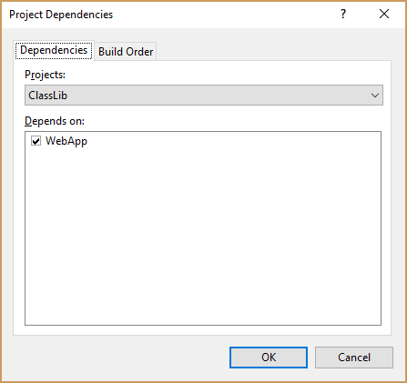

**Update:** Solution found, see the end of this document.

## Issue description

This repository reproduces a `dotnet build` issue we're facing.

We have a web application targeting `netcoreapp2.1`. and a class library targeting both `netstandard2.0` and `net47`.

The web application provides a web API, and we're using [NSwag](http://nswag.org/) to generate the corresponding C# client.
Therefore the build process must first build the web application, and the class library afterwards.

Because of this required order we have defined a Project Dependency in the solution:


However, while it builds fine in Visual Studio, it fails on the command line:

```cmd
$ dotnet build dotnetBuildIssue.sln
Microsoft (R) Build Engine version 15.8.166+gd4e8d81a88 for .NET Core
Copyright (C) Microsoft Corporation. All rights reserved.

  Restore completed in 42.36 ms for C:\work\tmp\dotnetBuildIssue\ClassLib\ClassLib.csproj.
  Restore completed in 63.56 ms for C:\work\tmp\dotnetBuildIssue\WebApp\WebApp.csproj.
  WebApp -> C:\work\tmp\dotnetBuildIssue\WebApp\bin\Debug\netcoreapp2.1\WebApp.dll
C:\Program Files\dotnet\sdk\NuGetFallbackFolder\microsoft.aspnetcore.app\2.1.1\build\netcoreapp2.1\Microsoft.AspNetCore.App.targets(14,5): error : This version of Microsoft.AspNetCore.App is only compatible with the netcoreapp2.1 target framework. Please target netcoreapp2.1 or choose a version of Microsoft.AspNetCore.App compatible with netstandard2.0. [C:\work\tmp\dotnetBuildIssue\WebApp\WebApp.csproj]
C:\Program Files\dotnet\sdk\NuGetFallbackFolder\microsoft.aspnetcore.app\2.1.1\build\netcoreapp2.1\Microsoft.AspNetCore.App.targets(14,5): error : This version of Microsoft.AspNetCore.App is only compatible with the netcoreapp2.1 target framework. Please target netcoreapp2.1 or choose a version of Microsoft.AspNetCore.App compatible with net47. [C:\work\tmp\dotnetBuildIssue\WebApp\WebApp.csproj]

Build FAILED.
```

To me it looks like *dotnet* uses the class library's TargetFramework `net47` to compile the web application, though we only set a project
dependency to enforce a specific build order.

Our real solutions contains more than 15 projects, so adding a build task
for each and every project in the ~~VSTS~~ Azure DevOps build pipeline
is less than optimal.

We would have preferred not having to define the dependency in the solution file, but we haven't found a working way to do it in the *.csproj* file.

Any hint how to enforce a specific order of the projects without a direct reference (we're targeting different frameworks) is welcome.

## Update: Solution found

Actually, some more research revealed that this issue is [known](https://github.com/Microsoft/msbuild/issues/3626) and will be fixed in **MSBuild 15.9**.
A temporary fix is also mentioned in above thread: put a file *Directory.Build.props* next to your solution file with following content:

```xml
<?xml version="1.0" encoding="utf-8"?>
<Project>
  <PropertyGroup>
    <!-- Solution build dependencies are not project dependencies. https://github.com/Microsoft/msbuild/issues/3626 -->
    <AddSyntheticProjectReferencesForSolutionDependencies>false</AddSyntheticProjectReferencesForSolutionDependencies>
  </PropertyGroup>
</Project>
```